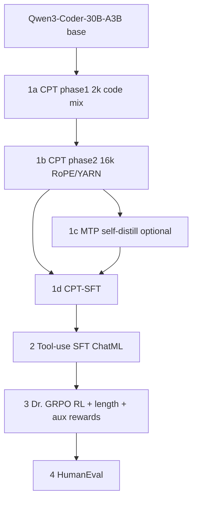

# OpenComposer

Mini-scale **Composer 2–style** training stack on a single **NVIDIA GH200 480GB**: **Qwen3-Coder-30B-A3B** (30B total / ~3B active MoE) as the primary base, with phased CPT, optional **MTP self-distillation**, **MoE router-replay utilities** (HF forwards), **Dr. GRPO + k1 KL**, **nonlinear length penalty** \(C_{k,q}\), and **behavioral auxiliary rewards** in RL.

## Fidelity: Composer 2 → this repo

| Composer 2 (paper) | Mini faithful version |
| --- | --- |
| Kimi K2.5–scale MoE | **Qwen3-Coder-30B-A3B** (paper’s MoE CPT→RL ablation family) |
| 3-phase CPT: 32k → 256k → SFT | **2k → 16k → CPT-SFT** (`scripts/cpt_phase1.py`, `cpt_phase2.py`, `cpt_phase3_sft.py`) |
| MTP layers, self-distilled | **1 MTP head** (`scripts/train_mtp.py`, `opencomposer/mtp/`) |
| Dr. GRPO + k1 KL + no length-std + no group-std | Same knobs via OpenRLHF (`--advantage_estimator dr_grpo`, `--kl_estimator k1`) |
| MoE router replay (sampler → trainer) | **Router replay via forward hooks** on `Qwen3MoeSparseMoeBlock` / `Qwen2MoeSparseMoeBlock` (`opencomposer/moe/`). **Training-time** use requires matching expert traces; see caveat below. |
| Nonlinear length penalty \(C_{k,q}\) | `opencomposer/rl/length_penalty.py` + `OPENCOMPOSER_LENGTH_*` env in `agent_func` |
| Behavioral aux rewards | `opencomposer/rl/behavior_rewards.py` + `OPENCOMPOSER_AUX_REWARDS` |
| MXFP8 / NVFP4, EP/CP/DeepEP, multi-region | **Out of scope** — document only |
| Async multi-region RL | **Synchronous on-policy** Ray/OpenRLHF; documented gap |

### Router replay and vLLM

**Hooks apply to Hugging Face PyTorch forwards.** Colocated **vLLM** rollouts (default in `scripts/rl_training.sh` when CUDA+vLLM are available) **do not expose** per-token MoE expert indices into Python. For strict router-replay experiments, use **HF generate** for rollouts (e.g. `FORCE_VLLM_ROLLOUT=0` / `--vllm_num_engines 0` paths in OpenRLHF) and wire `ExpertTrace` from `opencomposer/moe/router_replay.py`, or bridge with custom inference. OpenRLHF `extra_logs` from `agent_func` are numeric-only (see `opencomposer/rl/agent_func.py`).

## Pipeline



## Stages and scripts

| Stage | Description | Script / entry |
| --- | --- | --- |
| 0 | Data (SFT synth, RL tasks, tool schemas, corpus check) | `scripts/prepare_data.py` |
| 1a | CPT short context | `scripts/cpt_phase1.py` — `configs/qwen3_moe_cpt_phase1.yaml` |
| 1b | CPT long context + RoPE/YARN-style fields | `scripts/cpt_phase2.py` — `configs/qwen3_moe_cpt_phase2.yaml` |
| 1c | MTP self-distillation | `scripts/train_mtp.py` — `configs/qwen3_moe_mtp.yaml` |
| 1d | CPT-SFT | `scripts/cpt_phase3_sft.py` — `configs/qwen3_moe_cpt_phase3_sft.yaml` |
| 2 | Tool-use SFT (ChatML) | `scripts/sft_tool_use.py` — `configs/qwen3_moe_sft_toolu.yaml` |
| 3 | RL (Dr. GRPO, k1, agent, self-summary) | `bash scripts/rl_training.sh` — `configs/qwen3_moe_rl.yaml` |
| 4 | Evaluation | `python scripts/evaluate.py --checkpoint_path …` (HumanEval; `--suite humaneval`) |

### OpenRLHF install (Stage 3)

```bash
bash scripts/install_openrlhf_local.sh
```

Optional vLLM from source: `bash scripts/build_vllm_source.sh` (platform-dependent).

## Quick start (full model path)

```bash
pip install -r requirements.txt

# Stage 0
python scripts/prepare_data.py --stage all

# Stage 1 (use DeepSpeed ZeRO-3 offload JSON when GPU memory is tight)
deepspeed scripts/cpt_phase1.py --deepspeed configs/deepspeed_zero3_offload.json
deepspeed scripts/cpt_phase2.py --deepspeed configs/deepspeed_zero3_offload.json
# Optional MTP
python scripts/train_mtp.py
# CPT-SFT then tool SFT
python scripts/cpt_phase3_sft.py
deepspeed scripts/sft_tool_use.py --deepspeed configs/deepspeed_zero3_offload.json

# Stage 3
export PRETRAIN_PATH=./checkpoints/stage2_sft   # or HF id
bash scripts/rl_training.sh

# Stage 4
python scripts/evaluate.py --checkpoint_path ./checkpoints/stage3_rl
```

## Tiny MoE smoke (12 optimizer steps / GH200-friendly CI)

Uses a **smaller public MoE** by default so you can validate wiring without the 30B download. Override `SMOKE_MODEL` for Qwen3-Coder-30B-A3B on a large box.

```bash
bash scripts/smoke_qwen3_moe_pipeline.sh
```

Metadata for names/limits: `configs/smoke_qwen3_moe.yaml`. Smoke training configs live under `configs/smoke_qwen3_moe/`.

## RL reward tuning (env)

Set in the Ray `runtime_env` (see `scripts/rl_training.sh`) or shell:

- `OPENCOMPOSER_LENGTH_PENALTY` — `1` to enable (default), `0` to disable  
- `OPENCOMPOSER_LENGTH_K`, `OPENCOMPOSER_LENGTH_Q`, `OPENCOMPOSER_LENGTH_SCALE`  
- `OPENCOMPOSER_AUX_REWARDS` — e.g. `style,comms,tool_quality` or `none`

Tokenizer / model path for the agent: `OPENCOMPOSER_MODEL_PATH` or `PRETRAIN_PATH`.

## HumanEval / eval extras

- **ChatML**: `evaluation/run_humaneval.py` uses the tokenizer’s `apply_chat_template` when present (Qwen3 path).  
- **Optional MTP speculative decoding**: set `OPENCOMPOSER_MTP_SPECULATIVE=1` to log intent; full draft–target speculative path is not enabled by default (falls back to standard generation).

## Hardware notes (GH200 480GB)

- BF16 30B MoE weights are large; prefer **ZeRO-3 + CPU offload** and **8-bit AdamW** (`optim: adamw_bnb_8bit` in YAMLs).  
- RL: vLLM `gpu_memory_utilization` tunable via `RL_VLLM_GPU_MEM_UTIL`; `RL_ENFORCE_EAGER=1` helps hook/debug paths.

## License / data

Some datasets (e.g. StarCoder) require accepting licenses on Hugging Face before streaming.
